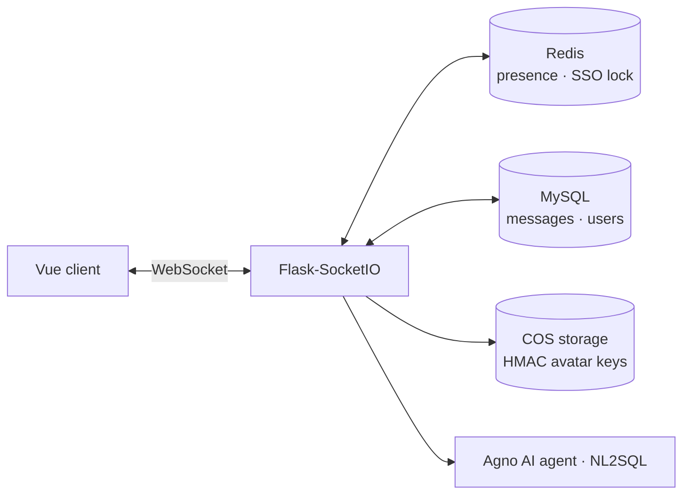
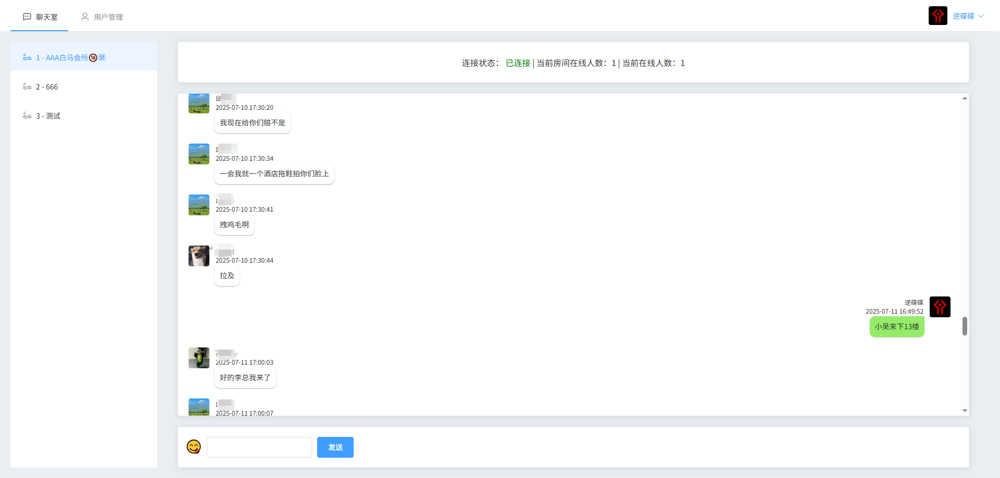
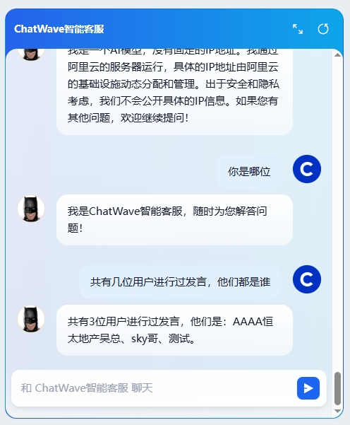

# Real-Time Chat Platform with AI Support Agent

A multi-room real-time chat web app: WebSocket messaging, Redis-backed presence and single-session login, JWT auth, and an embedded NL2SQL AI support agent.

**Live demo:** https://chat.bro9.vip — demo account `test` / `123456`

---

## Key Features

- **Real-time multi-room chat** over WebSocket (Flask-SocketIO), with per-room online counts and room switching.
- **Redis-backed presence.** Tracks who is online and which room they are in, in real time.
- **Single-session login.** A Redis lock enforces one active web session per user — opening a new window disconnects the previous one.
- **JWT authentication** on the API layer.
- **Privacy-safe avatars.** Avatar object keys on cloud storage are derived via HMAC, so files can't be enumerated or scraped.
- **Infinite-scroll history.** Older messages load as you scroll up.
- **Embedded AI support agent.** Started as a Dify integration and was rebuilt as an autonomous **Agno** agent with **NL2SQL**, so it can answer questions backed by live business data.
- **Non-intrusive notifications.** New-message alerts use title-bar blinking instead of browser pop-ups.

## Tech Stack

| Layer | Technology |
|-------|-----------|
| Real-time backend | Flask, Flask-SocketIO (eventlet) |
| State / cache | Redis (presence, room tracking, session lock) |
| Data | SQLAlchemy + MySQL |
| Auth & security | PyJWT, cryptography (HMAC), Flask-WTF / WTForms validation |
| Storage | Tencent Cloud COS (object storage) |
| AI | Agno agent, OpenAI-compatible LLM, NL2SQL |
| Frontend | Vue |
| Infra | Docker, Nginx, Certbot, Gunicorn |

## Architecture



## Screenshots

| Chat UI | AI support |
|---------|-----------|
|  |  |

## Getting Started

```bash
pip install -r requirements.txt
cp .env.example .env        # set DB / Redis / JWT / COS / LLM config

# Development
python app.py

# Production
gunicorn -c gunicorn_config.py app:app
```

## Project Structure

```
apps/
  views/       # HTTP routes: chat, login, rooms, upload, user
  ws/          # WebSocket server
  model/       # ORM models
  middleware/  # auth decorators
  forms/       # request validation
utils/         # JWT, Redis, COS, response envelope
dify/          # legacy AI support workflow export
```
